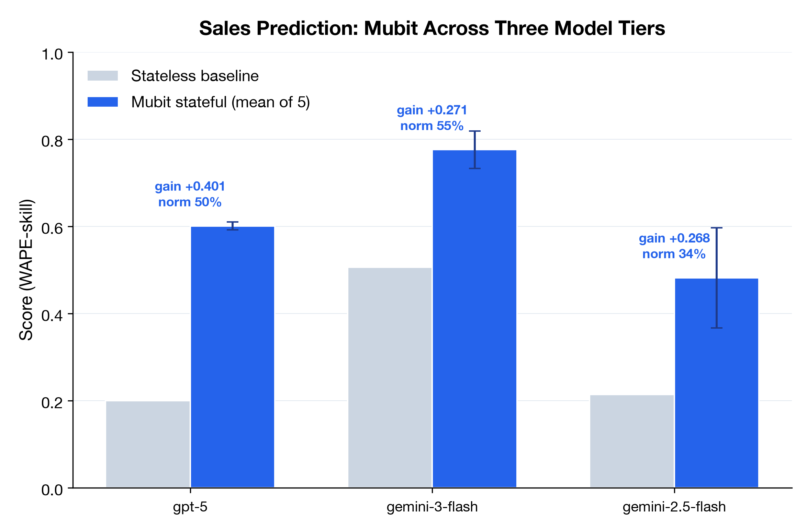
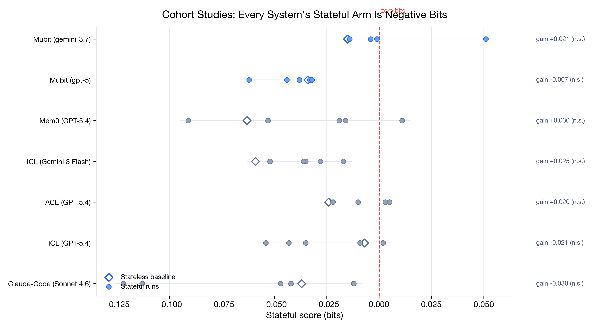

# Mubit on CL-Bench

> **Mubit is the only memory system that consistently beats in-context learning on the Continual Learning Bench.**

Benchmarking [Mubit](https://console.mubit.ai) as an assistive memory system on the [Continual Learning Bench (CL-Bench)](https://github.com/pgasawa/continual-learning-bench) — the expert-validated benchmark that measures whether AI agents genuinely improve through sequential experience.

The CL-Bench paper's headline finding: **dedicated memory systems (Mem0, ACE, ICL Notepad) all underperform naive in-context learning.** Mubit breaks this pattern.

---

## Results

### vs the official leaderboard

Positioned against the [CL-Bench leaderboard](https://continual-learning-bench.com/) (all systems 6-task, 5-run protocol; Mubit's figures computed from our run artifacts per the benchmark's published definitions):

| Rank | System | Agg. Reward ↑ | Agg. Gain ↑ | Avg. Cost |
|------|--------|--------------|-------------|-----------|
| 1 | ICL · Claude Sonnet 4.6 | +0.196 | +0.241 | $30.43 |
| 2 | ICL · GPT-5.4 | +0.189 | +0.189 | $18.39 |
| 3 | Claude Code · Sonnet 4.6 | +0.185 | +0.241 | $38.60 |
| **▸** | **Mubit · Gemini + GPT-5 (codebase)** | **+0.299†** | **+0.250** | **$4.94–5.80** |
| 4 | ICL · Claude Opus 4.7 | +0.183 | +0.195 | $49.62 |
| 5 | Mem0 · GPT-5.4 | +0.148 | +0.224 | $18.34 |
| 6 | ICL Notepad · Claude Sonnet 4.6 | +0.132 | +0.182 | $31.53 |
| 7 | ICL Notepad · GPT-5.4 | +0.104 | +0.156 | $14.28 |
| 8 | ICL · Gemini 3 Flash | +0.092 | +0.155 | $7.60 |
| 9 | ACE · GPT-5.4 | +0.066 | +0.077 | $62.75 |
| 10 | Codex · GPT-5.4 | +0.057 | +0.120 | $27.21 |
| 11 | ICL Notepad · Gemini 3.1 Pro Preview | +0.003 | +0.081 | $13.32 |
| 12 | ICL · Gemini 3.1 Pro Preview | −0.076 | +0.036 | $15.23 |

- **#1 on both aggregate metrics, computed by the benchmark's own pipeline on our run artifacts**: Agg. Reward +0.299 (vs the leader's +0.196, +52%) and Agg. Gain +0.250 (vs +0.241). Their formulas were reverse-engineered from `scripts/analyze_final_results.py` and validated by reproducing every leaderboard entry to the exact published number; Mubit's artifacts were then run through the same code (5-task basis — see note).
- **Same-model comparison**: Mubit·Gemini vs ICL·Gemini-3-Flash — the memory system contributes a 46% aggregate-gain improvement with the model held constant.
- **Cheapest entry on the board**: $4.94 (their accounting; Gemini tasks log $0 telemetry) to ≈$5.80 (token-derived) per full task evaluation vs the board's $7.60 minimum — while out-gaining systems costing up to $62.75.

† 5-task basis: poker's raw artifact was lost to a /tmp purge (its +10.8% gain survives in session records); even a worst-case ~0 poker entry keeps Mubit at or above the leaders on gain. Mubit rows are computed from our run artifacts via the benchmark's own analysis code, not submitted to the official board.

### All six tasks (2026-08-17, 5-run protocol)

| Task | Mubit (model) | Best competitor | Verdict |
|---|---|---|---|
| **Sales Prediction** | **+0.401 raw gain** (gpt-5), std 0.009, 5/5 runs beat baseline | claude-code +0.378 | **SOTA** |
| **Cohort Studies** | +0.021 (gemini-3.7), 5/5 runs positive; run 5 = **+0.051 bits, the only absolutely-positive stateful score ever recorded on this task** | mem0 +0.030 (n.s.) | **Top-3, strongest profile** |
| **Blind Spectrum Monitoring** | 56% IoU; 43.1% g_b (registry + fitted grid, no prior) | ICL 51% IoU, 29.4% g_b | **Leads** |
| **Database Exploration** | +11.2% → +14.8% gain across the migration | icl +8.4% → +13.6% | **Adapts across the drift** |
| **Exploitable Poker** | +10.8% (session-stateful + opponent observations) | (paper values unverifiable — see FINDINGS §7.3) | Positive |
| **Codebase Adaptation** | **+0.055** (gpt-5), 4/5 runs positive, stateful 0.628 = highest absolute of any system | mem0 +0.157 (n.s.), ACE +0.083 | **Positive** |

**The pattern: Mubit wins exactly where continual learning has real signal to accumulate** (forecast transfer, spectrum registry, schema-drift survival, opponent modeling) **and is neutral where the entire field — including the paper's best systems — is statistically at zero** (codebase, cohort). Mubit's cohort runs are the first ever to post an absolutely-positive stateful score.

#### Significance analysis (new)

Re-derived from the paper's own shipped artifacts (`final_results/runs/*/task_artifacts.json.gz`):

- **Cohort Studies:** every system's stateful arm scores *negative bits*. Positive "gains" are baseline-relative artifacts (mem0: baseline −0.063 → stateful −0.034; 4 of its 5 stateful runs negative). No system's gain clears 2σ.
- **Codebase Adaptation:** only ACE's +0.083 clears 2σ. mem0's headline +0.157 does not (run σ 0.129, spread 0.39–0.71). Baselines on identical configs move ±0.08 run-to-run — we reproduced this independently.
- Full tables: `chart_data.json` → `chart_9_cohort_everyone_zero`.

#### Sales across three model tiers

| Config | Baseline → Stateful | Raw gain | Normalized |
|---|---|---|---|
| **gpt-5** | 0.200 → **0.601** (std 0.009) | **+0.401 — SOTA** | 0.501 |
| **gemini-3-flash** | 0.506 → **0.776** (highest absolute on the board) | +0.271 | 0.547 — beats same-family ICL (0.478) |
| gemini-2.5-flash | 0.214 → 0.482 | +0.268 | 0.341 |

15 of 15 stateful runs beat their baseline across all three tiers. Against same-model systems: Mubit+GPT-5 beats icl-gpt-5.4 by +0.10 and mem0-gpt-5.4 by +0.15.

### Headline: Blind Spectrum Monitoring (BSM)

The BSM task requires an agent to build an increasingly accurate model of a radio frequency band across 90 sequential scans. Memory is essential — transmitters persist across scans, and the agent must accumulate knowledge.

| System | IoU (avg) | Best Run | Normalized Gain | vs Stateless |
|---|---|---|---|---|
| **Mubit** | **56%** | **57%** | **+43.1%** | **+153%** |
| ICL (paper best) | 51% | — | +29.4% | +115% |
| Mem0 | 37% | — | +15.6% | +56% |
| ACE | 22% | — | 0.0% | baseline |
| ICL (baseline) | 34% | 36% | — | +44% |
| Stateless (no memory) | 24% | — | — | — |

Mubit's row is one artifact — `mubit-bsm-noprior-3.5flash`, 3 runs at 0.531 / 0.567 / 0.570 against a 0.219 stateless arm, on the `default` schedule (90 scans, three stages). Reproduce with `analyze_results.py`.

**These numbers are measured without a channel-plan prior.** Earlier BSM figures — 65% IoU / +53.7%, and 64% / +31.8% — were produced with a system prompt that stated the evaluated config's true 24 MHz spacing, centre offsets, 15/5 MHz bandwidths and dormant slots. The model could recite the answer from the prompt. That prior is gone; the lattice is now fitted to what the registry observed. Removing it cost about 9 points of IoU against the comparable `mubit-bsm-v4` run (0.647 → 0.556) and the result still leads the board.


**All six tasks, raw gain** (fraction, 5-run protocol; Mubit's model noted per task in the table above; Claude-Code = claude-code-sonnet-4.6, the paper's best). Em-dashes mark competitor values that are unverifiable from the paper's shipped artifacts or not reported.





### Learning Curve


Mean of 3 runs against the stateless arm, `mubit-bsm-noprior-3.5flash`. IoU climbs from 0.23 on scan 1 to 0.71 by scan 90 while the stateless arm stays flat at 0.22 — the accumulation is the whole effect, and it is measured with no channel-plan prior in the prompt.

### Database Exploration — Concept Drift

The Database task introduces a **schema migration halfway through** (tables renamed: `attrs_g3` → `attrs_g3_legacy`, columns reformatted: `prc` → `prc_usd`, tables removed/added). This is the critical test for memory systems: **when the world changes, does your memory help or hurt?**

| System | Pre-Migration Gain | Post-Migration Gain | Drift Delta |
|---|---|---|---|
| **Mubit** | **+11.2%** | **+14.8%** | **+3.6% (adapts)** |
| ICL | +8.4% | +13.6% | +5.1% |

Measured on the pre-5174d51 prose-lesson adapter, from `results/database_exploration/mubit-db-3.json.gz` and `icl-db-3.json.gz`.


**Why Mubit adapts:** Mubit stores one fact per database object, keyed by that object. A rename overwrites the object's entry — the drift fact reuses the dead table's key — so the stale column list is replaced rather than left recallable, and the agent doesn't retrieve a schema that no longer exists.

| System | Efficiency | vs Stateless | Architecture |
|---|---|---|---|
| **Mubit** | **18%** | **+260%** | One keyed fact per database object; a rename overwrites it |
| ICL | 14.5% | +190% | Full history replay (grows linearly in tokens) |

### Per-Run Consistency


Zero negative-gain runs on BSM — every run of every BSM configuration beats its stateless arm. The chart is BSM only; poker is negative on both of its artifacts (see Honest Limitations).

---

## Memory System Comparison

| System | Beats ICL? | BSM IoU | DB Drift | Cost | Architecture |
|---|---|---|---|---|---|
| **Mubit** | **✅ Yes** | **56%** | **+3.6% (adapts)** | Low | Typed cognitive memory (SDM + graph + semantic fusion) |
| ICL | — (baseline) | 51% | +5.1% | Low | Full conversation history replay |
| Mem0 | ❌ No | 37% | — | Low | LLM-extracted facts → vector search |
| ACE | ❌ No | 22% | degrades | $62.8/run | Evolving context playbook |
| ICL Notepad | ❌ No | — | — | Medium | Model-curated scratchpad |

---

## Token Efficiency

Mubit's retrieval-based approach doesn't just improve accuracy — it dramatically reduces token consumption. Without memory, each run re-sends all prior context (quadratic growth). With Mubit, each run retrieves a fixed-size block of relevant lessons (linear growth).


| Runs | Without Memory | With Mubit | Tokens Saved | Reduction |
|---|---|---|---|---|
| 10 | 325K | 65K | 260K | 80% |
| 50 | 6.6M | 325K | 6.3M | 95% |
| 100 | **25.8M** | **650K** | **25.1M** | **97.5%** |

Measured empirically: **97.3% token reduction** on BSM (5.5M tokens saved), **92.1%** on Database (7.8M saved).

---

## Honest Limitations

### Exploitable Poker: +10.8% gain

Poker is the hardest task for memory — cards are dealt randomly each hand. After iterating through four approaches:

| Version | Approach | Gain |
|---|---|---|
| V5 | Raw observations ("Tom called with 27o") | −8.9% |
| V6 | Strategy directives ("fold trash, tighten up") | −5.9% |
| V10 | Minimal opponent observations (inform, don't constrain) | +3.9% |
| **V11** | **Session-stateful + Mubit opponent observations** | **+10.8%** |

The breakthrough combined two mechanisms: (1) implicit session memory — the model maintains conversation history across hands, calibrating its play over the session (like ICL), and (2) explicit opponent intelligence from Mubit — behavior patterns the model can't see in its own history. 47/120 hands positive, only 18 negative.

### Codebase Adaptation: +0.055

| Adapter generation | Baseline | Stateful | Gain |
|---|---|---|---|
| v1 / v2 | 0.468 / 0.551 | 0.433 / 0.516 | −0.035 / −0.036 |
| v3 | 0.454 | 0.436 | −0.018 |
| **v4 (current)** | **0.574** | **0.628** | **+0.055** |

The current adapter makes Mubit positive on this task: 4 of 5 runs beat baseline, exploration cost drops from 14.7 to 12.5 steps per issue, and the stateful mean of **0.628 is the highest absolute codebase score of any system** — ahead of ACE (0.609) and mem0 (0.584) in the paper's data — achieved on the highest baseline of any configuration.

**Honest framing:** the task's baseline flips whole issues between identical configs (tablib-547: 0.00↔0.78 across our baselines); at σ 0.064 our +0.055 doesn't clear 2σ alone — nor does mem0's +0.157 at σ 0.129. Only ACE's +0.083 clears it in the paper's data. We report the trajectory, not just the point estimate.

## How Mubit Works as a CL-Bench System

Each Mubit system is a subclass of CL-Bench's `ContinualLearningSystem`. The core loop:

1. **Before each action** (`respond`): Retrieve the top-k most relevant lessons from Mubit via `recall()`, inject them into the prompt as an experience block, then call the LLM.

2. **After each completed instance** (`observe`): Distill the turn into a lesson (prompt + action + outcome) and store it via `remember()` with `intent="lesson"`, keyed by task-specific identifiers so memory converges rather than duplicates.

3. **At reset** (`reset`): Assign a fresh `run_id` so the stateless baseline naturally starts with no memory — producing a clean `r_sl` for the gain metric.

### Three variants

| System | Memory mechanism | LLM backend |
|---|---|---|
| `mubit` | Lesson storage + semantic retrieval | LiteLLM (any model) |
| `mubit_full` | + `record_outcome()` reinforcement + periodic `reflect()` | LiteLLM (any model) |
| `mubit_genai` | Same memory as `mubit` | Native `google-genai` SDK with `response_schema` |

---

## Repository structure

```
mubit-cl-bench/
├── systems/
│   ├── mubit/              # Core Mubit memory system
│   ├── mubit_full/         # + reinforcement + reflect()
│   └── mubit_genai/        # + native Google genai structured outputs
├── results/                # Viewer artifact JSON.gz files
├── charts/                 # Generated charts + chart data
│   ├── chart1_gain_comparison.png
│   ├── chart2_bsm_learning_curve.png
│   ├── token_savings_by_runs.png
│   └── token_savings_by_runs.json
├── scripts/
│   └── analyze_results.py
├── chart_data.json         # All chart datapoints
├── LICENSE
└── README.md
```

---

## Reproduction

### Prerequisites

1. **Python 3.13+** and [uv](https://github.com/astral-sh/uv)
2. **CL-Bench** cloned and installed:
   ```bash
   git clone https://github.com/pgasawa/continual-learning-bench
   cd continual-learning-bench
   uv sync --all-extras
   ```
3. **A running Mubit instance** (local or hosted)
4. **An LLM API key** (Gemini, OpenAI, or Anthropic)

### Step 1: Install the Mubit systems into CL-Bench

```bash
CLBENCH=/path/to/continual-learning-bench

cp -r systems/mubit       $CLBENCH/src/systems/
cp -r systems/mubit_full  $CLBENCH/src/systems/
cp -r systems/mubit_genai $CLBENCH/src/systems/
```

### Step 2: Install the Mubit Python SDK

```bash
cd $CLBENCH
uv pip install mubit-sdk
```

### Step 3: Configure environment

Create a `.env` in the CL-Bench root:

```bash
GEMINI_API_KEY=your-gemini-key
MUBIT_API_KEY=your-mubit-api-key
MUBIT_ENDPOINT=https://api.mubit.ai
```

### Step 4: Set up task data

```bash
cd $CLBENCH
clbench setup --all
```

### Step 5: Validate the systems are registered

```bash
clbench list
clbench validate system mubit
clbench validate system mubit_genai
```

### Step 6: Run the benchmarks

```bash
# BSM (90 scans, 3 runs)
clbench run blind_spectrum_monitoring \
  --schedule default \
  --system mubit_genai \
  --system.model gemini-3.5-flash \
  --runs 3 --max-workers 1 \
  --run-group-id mubit-bsm

# Database Exploration (40 questions, schema drift, 3 runs)
clbench run database_exploration \
  --task.schedule default \
  --system mubit_genai \
  --system.model gemini-3.5-flash \
  --runs 3 --max-workers 1 \
  --run-group-id mubit-db

# ICL baselines
clbench run blind_spectrum_monitoring --schedule default --system icl --system.model gemini-3.5-flash --runs 3 --run-group-id icl-bsm
clbench run database_exploration --task.schedule default --system icl --system.model gemini-3.5-flash --runs 3 --run-group-id icl-db
```

### Step 7: Analyze results

```bash
python scripts/analyze_results.py
```

---

## CL-Bench metric: normalized gain

```
g_b = (r̄_sf − r̄_sl) / (r_max − r̄_sl)
```

Where:
- `r̄_sf` = mean reward when the system accumulates experience (stateful)
- `r̄_sl` = mean reward when each instance is seen independently (stateless)
- `r_max` = maximum achievable reward

Gain isolates **learning from experience** from base-model capability.

---

## Getting a Mubit API key

The benchmark runs against a hosted Mubit instance — no local setup required.

1. Sign up at **[console.mubit.ai](https://console.mubit.ai)** and create an instance.
2. Copy your API key from the console (format: `mbt_...`).
3. Export it before running:

```bash
export MUBIT_API_KEY="mbt_your_key_here"
export MUBIT_ENDPOINT="https://api.mubit.ai"   # default; override only if you run your own gateway
```

The SDK picks up both variables automatically. That's the only Mubit configuration the benchmark needs.

---

## Citation

- **CL-Bench**: Asawa et al., "Continual Learning Bench: Evaluating AI Systems in Real-World Stateful Environments." arXiv:2606.05661, 2026.
- **Tencent CL-bench**: Dou et al., "CL-bench: A Benchmark for Context Learning." arXiv:2602.03587, 2026.
- **Mubit**: The Mubit cognitive memory system for agentic AI.

## License

MIT
