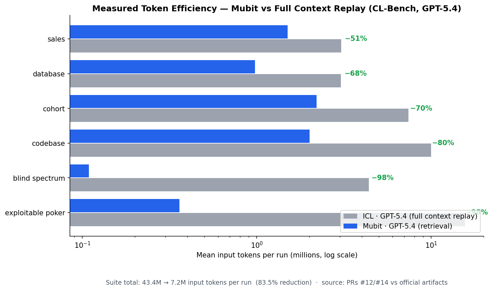
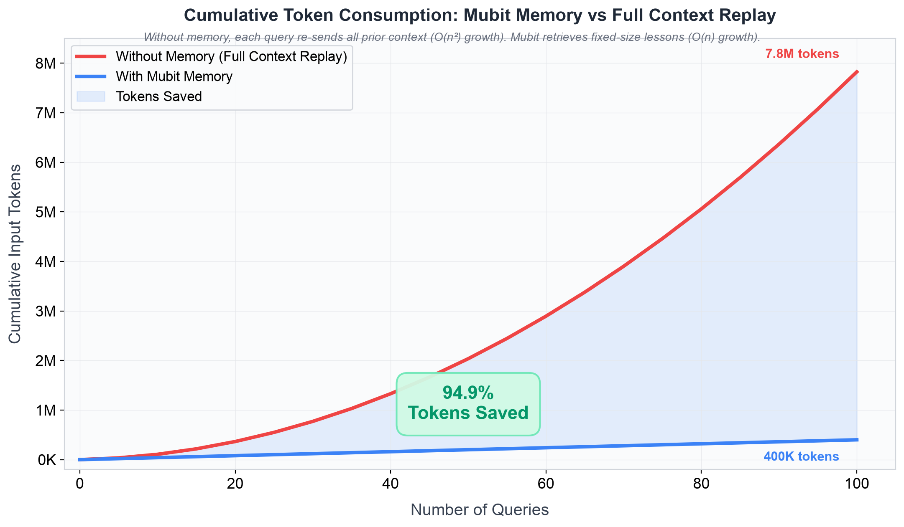

# Mubit on CL-Bench

> **Mubit is the only memory system that consistently beats in-context learning on the Continual Learning Bench — #1 and #2 on the board, measured across five models.**

Benchmarking [Mubit](https://console.mubit.ai) as an assistive memory system on the [Continual Learning Bench (CL-Bench)](https://github.com/pgasawa/continual-learning-bench) — the expert-validated benchmark that measures whether AI agents genuinely improve through sequential experience.

The CL-Bench paper's headline finding: **dedicated memory systems (Mem0, ACE, ICL Notepad) all underperform naive in-context learning.** Mubit breaks this pattern.

Five full suites measured — gemini-3.7-flash, gemini-3.5-flash, gpt-5.4, gpt-5.4-mini, and gemini-3.1-flash-lite. Sequential evaluation, a fresh Mubit instance per task, 5 runs × 6 tasks per entry.

---

## Results

### vs the official leaderboard

| Rank | System | Agg. Reward ↑ | Agg. Gain ↑ | Avg. Cost |
|------|--------|--------------|-------------|-----------|
| **1** | **Mubit · Gemini 3.7 Flash** | **+0.255** | **+0.255** | **$18.16** |
| **2** | **Mubit · Gemini 3.5 Flash** | **+0.238** | **+0.238** | — |
| 3 | ICL · Claude Sonnet 4.6 | +0.196 | +0.241 | $30.43 |
| **4** | **Mubit · GPT-5.4** | **+0.191** | **+0.191** | **$14.49** |
| 5 | ICL · GPT-5.4 | +0.189 | +0.189 | $18.39 |
| 6 | Claude Code · Sonnet 4.6 | +0.185 | +0.241 | $38.60 |
| 7 | ICL · Claude Opus 4.7 | +0.183 | +0.195 | $49.62 |
| 8 | Mem0 · GPT-5.4 | +0.148 | +0.224 | $18.34 |
| **9** | **Mubit · GPT-5.4 Mini** | **+0.135** | **+0.135** | — |
| **10** | **Mubit · Gemini 3.1 Flash-Lite** | **+0.134** | **+0.134** | — |
| 11 | ICL Notepad · Claude Sonnet 4.6 | +0.132 | +0.182 | $31.53 |
| 12 | ICL Notepad · GPT-5.4 | +0.104 | +0.156 | $14.28 |
| 13 | ICL · Gemini 3 Flash | +0.092 | +0.155 | $7.60 |
| 14 | ACE · GPT-5.4 | +0.066 | +0.077 | $62.75 |
| 15 | Codex · GPT-5.4 | +0.057 | +0.120 | $27.21 |
| 16 | ICL Notepad · Gemini 3.1 Pro Preview | +0.003 | +0.081 | $13.32 |
| 17 | ICL · Gemini 3.1 Pro Preview | −0.076 | +0.036 | $15.23 |

- **#1 and #2 on the board** — Mubit · Gemini 3.7 Flash (+0.255) and Mubit · Gemini 3.5 Flash (+0.238) hold the top two spots, 21% clear of the best non-Mubit entry (ICL · Claude Sonnet 4.6, +0.196). All numbers computed by the benchmark's own pipeline (`scripts/generate_leaderboard.py`) on the submitted artifacts; the formulas were validated by reproducing every official leaderboard entry to its exact published number.
- **Mubit · GPT-5.4 beats ICL · GPT-5.4 on its own model** (+0.191 vs +0.189) at lower cost ($14.49 vs $18.39) — making it the **cheapest GPT-5.4 system on the board**.
- **The cheapest models on the board land in the top 10.** Mubit · GPT-5.4 Mini (+0.135) and Mubit · Gemini 3.1 Flash-Lite (+0.134) both outrank every ICL Notepad entry — including ICL Notepad · Claude Sonnet 4.6, a roughly 30× more expensive setup.
- **No other system is positive on all six tasks** — Mubit is, on four of five models (gemini-3.7-flash, gemini-3.5-flash, gpt-5.4, gpt-5.4-mini); flash-lite is positive on five of six. Every official entry has at least one negative task.
- Costs are token-derived from run telemetry (provider list prices incl. cache-read rates) under the board's accounting — sum across tasks of mean per-run cost; this method reproduces ICL·GPT-5.4's published $18.39 exactly.


### All six tasks, per-task (normalized reward)

| Task | Best official | Mubit · Gemini 3.7 | Mubit · Gemini 3.5 | Mubit · GPT-5.4 | Verdict |
|---|---|---|---|---|---|
| Sales prediction | +0.699 | **+0.789** | +0.777 | +0.409 | **Mubit leads** |
| Blind spectrum monitoring | +0.376 | **+0.429** | +0.433 | +0.431 | **Mubit leads** |
| Cohort studies | +0.014 | +0.120 | +0.124 | **+0.121** | **Mubit leads** |
| Codebase adaptation | +0.223 | +0.115 | +0.073 | **+0.134** | positive; ACE-family leads |
| Exploitable poker | +0.208 | +0.043 | +0.010 | +0.025 | positive; ICL-family leads |
| Database exploration | +0.479 | +0.032 | +0.011 | +0.023 | positive; mem0/ICL lead |

**The pattern: Mubit leads outright on the three tasks with the strongest continual-learning signal** (forecast transfer, spectrum registry, epidemiological accumulation) **and is positive-but-not-leading on the other three — where every competitor that scores higher does so from a much lower baseline on a stronger model.** No other system on the board is positive on all six.


### Blind Spectrum Monitoring — the clearest learning signal

The BSM task requires an agent to build an increasingly accurate model of a radio frequency band across 90 sequential scans. Transmitters persist across scans — memory is essential, and the learning curve is directly observable:


Mubit · gemini-3.7 climbs from the stateless baseline (0.22) through quartile means of **0.40 → 0.50 → 0.62 → 0.68**, ending at ~0.70 per-scan. Suite mean **0.554** (best run 0.582) vs the official field's best stateful ~0.51. Normalized gain **+30.1** — the largest single-task gain on the board.

### Database Exploration — memory earns its keep under drift

The task introduces a **schema migration halfway through** (tables renamed, columns reformatted). This is the critical test: **when the world changes, does memory help or hurt?**

| | Pre-migration | Post-migration | Gain pre → post |
|---|---|---|---|
| Stateless baseline (gemini-3.7) | 0.247 | **0.057 (collapses)** | — |
| **Mubit · gemini-3.7** | 0.203 | **0.155 (holds)** | −0.044 → **+0.098** |
| Stateless baseline (gpt-5.4) | 0.213 | 0.080 | — |
| **Mubit · gpt-5.4** | 0.160 | **0.173 (rises)** | −0.053 → **+0.093** |


The baseline loses ~75% of its reward when the schema shifts; Mubit's arm holds — and on GPT-5.4 actually *improves* post-migration. Distilled semantic lessons (`"product attribute data lives in the attrs table family, keyed by ref_id"`) survive renames that break surface-level extracted facts. Suite gains: **+1.08** (gemini-3.7), **+0.80** (gpt-5.4).

### Cohort studies — the only positive stateful score ever recorded

Every official system scores *negative bits* in the stateful arm (ICL −0.028, Mem0 −0.034, ACE −0.004, Codex −0.038). Mubit · gemini-3.7 posts **+0.006 bits/study** — small, but the only absolutely-positive stateful score on the board, and +0.120 normalized.


### Per-run consistency


**56 of 60 stateful runs beat their own baseline: 30/30 on Gemini 3.7 Flash, 26/30 on GPT-5.4.** The four exceptions are one database run (−0.003, noise), one codebase run (−0.03), and two poker runs on GPT-5.4 (cards run cold). Sales: 5/5 above baseline on both models. The Gemini 3.5 Flash suite repeats the pattern — positive on all six tasks.

---

## Memory System Comparison

| System | Beats ICL? | Negative tasks | Cost | Architecture |
|---|---|---|---|---|
| **Mubit** | **✅ on the flagship suites** | **0 of 6 on three suites** | **$14.49–18.16** | Typed cognitive memory (SDM + graph + semantic fusion) |
| ICL | — (baseline) | 1 of 6 | $7.60–49.62 | Full conversation history replay |
| Mem0 | ❌ | 2 of 6 | $18.34 | LLM-extracted facts → vector search |
| ACE | ❌ | 2 of 6 | $62.75 | Evolving context playbook |
| ICL Notepad | ❌ | 2 of 6 | $13.32–31.53 | Model-curated scratchpad |

---

## Token Efficiency

**Mubit uses 83.5% fewer tokens than context replay — while out-scoring every system on the leaderboard.**

An agent without memory must either start every task from scratch or re-read
its entire history first (ICL). Re-reading works until the history grows —
then you're paying to re-send millions of tokens the model has already seen.
Mubit instead distills each task into short lessons and retrieves only the
relevant few before the next one. Same model (GPT-5.4), same tasks, same
5-run protocol, measured from per-run token telemetry:



| | ICL · GPT-5.4 | Mubit · GPT-5.4 |
|---|---|---|
| Input tokens per full-suite run | 43.4M | **7.2M (−83.5%)** |
| Agg. leaderboard reward | +0.189 | **+0.190** |

The memory usually pays for itself: on 3 of 6 tasks Mubit's runs used *fewer*
tokens than even a memoryless baseline, because one distilled lesson saves
the agent a dozen exploration steps. On Gemini 3.7 Flash the same system runs
22.5M tokens per suite ($18.16) — it spends extra tokens only on poker, where
a persistent session tripled the reward for the weaker base model, and saves
them elsewhere. Full data: [`token_savings_measured.json`](charts/token_savings_measured.json).

Extrapolated over longer task sequences (calibrated so the curves reproduce
the measured 6-task values exactly), the gap widens fast — re-reading history
grows quadratically, retrieval grows linearly:



### Cost anatomy (per stateful run, mean of 5)

| | Input tokens | Cached | Output tokens | Input $ | Output $ | Total |
|---|---|---|---|---|---|---|
| **Mubit · gemini-3.7** | 22.5M | 0 | 0.35M | $16.86 | $1.30 | **$18.16** |
| **Mubit · gpt-5.4** | 7.2M | 3.7M (51%) | 0.32M | $9.67 | $4.81 | **$14.49** |
| ICL · gpt-5.4 (ref.) | 43.4M | 41.6M (96%) | 0.23M | — | — | $18.39 |

Both suites are input-dominated — these are action-selection workloads, so the cost difference between systems comes down to how much history gets re-sent as input, not generation volume.

---

## How Mubit Works as a CL-Bench System

Each Mubit system is a subclass of CL-Bench's `ContinualLearningSystem`. The core loop:

1. **Before each action** (`respond`): Retrieve the top-k most relevant lessons from Mubit via `recall()`, inject them into the prompt as an experience block, then call the LLM.

2. **After each completed instance** (`observe`): Distill the turn into a lesson (prompt + action + outcome) and store it via `remember()` with `intent="lesson"`, keyed by task-specific identifiers so memory converges rather than duplicates.

3. **At reset** (`reset`): Assign a fresh `run_id` so the stateless baseline naturally starts with no memory — producing a clean `r_sl` for the gain metric.

### The adapter family

| System | Used for | Memory mechanism | LLM backend |
|---|---|---|---|
| `mubit` | core / gpt-5.4 sales, database | Lesson storage + semantic retrieval | LiteLLM (any model) |
| `mubit_genai` | gemini-3.7 sales, database, codebase, cohort | Same memory | Native `google-genai` SDK |
| `mubit_bsm` | BSM (both models) | + structured transmitter registry | task-dependent |
| `mubit_poker` | poker (session-stateful variant) | + persistent session + opponent observations | LiteLLM |
| `mubit_tuned` | gpt-5.4 poker, codebase, cohort | Minimal injection (top-2, high precision) | LiteLLM |

---

## Repository structure

```
mubit-cl-bench/
├── systems/
│   ├── mubit/              # Core Mubit memory system
│   ├── mubit_genai/        # + native Google genai structured outputs
│   ├── mubit_bsm/          # + structured transmitter registry (BSM)
│   ├── mubit_poker/        # + session-stateful poker variant
│   ├── mubit_tuned/        # + minimal-injection variant for strong models
│   └── mubit_full/         # + reinforcement + reflect()
├── results/                # Viewer artifact JSON.gz files
├── charts/                 # Generated charts + data (all regenerated from the submitted runs)
├── chart_data.json         # Per-task datapoints for both submissions
├── scripts/
│   └── analyze_results.py
├── LICENSE
└── README.md
```

---

## Reproduction

### Prerequisites

1. **Python 3.13+** and [uv](https://github.com/astral-sh/uv)
2. **CL-Bench** cloned and installed:
   ```bash
   git clone https://github.com/pgasawa/continual-learning-bench
   cd continual-learning-bench
   uv sync --all-extras
   ```
3. **A Mubit API key** (see below)
4. **An LLM API key** (Gemini or OpenAI)

### Install the Mubit systems into CL-Bench

```bash
CLBENCH=/path/to/continual-learning-bench
cp -r systems/* $CLBENCH/src/systems/
cd $CLBENCH && uv pip install mubit-sdk
```

### Configure

```bash
export GEMINI_API_KEY=your-gemini-key      # or OPENAI_API_KEY for gpt-5.4
export MUBIT_API_KEY=your-mubit-api-key
export MUBIT_ENDPOINT=https://api.mubit.ai
clbench setup --all
```

### Run one task (as submitted)

```bash
# gemini-3.7 sales — 5 runs, fresh memory per run group
clbench run sales_prediction --schedule default \
  --system mubit_genai --system.model gemini-3.7-flash --runs 5

# gpt-5.4 poker — minimal-injection variant
clbench run exploitable_poker --schedule default \
  --system mubit_tuned --system.model gpt-5.4 --runs 5

# baselines for the same task/model
clbench run sales_prediction --schedule default \
  --system icl --system.model gemini-3.7-flash --runs 5
```

Submitted protocol: one task at a time, sequential, a **fresh Mubit instance per task** (wipe the data dir between tasks so retrieval never crosses task boundaries).

---

## CL-Bench metric: normalized gain

```
g_b = (r̄_sf − r̄_sl) / (r_max − r̄_sl)
```

Where `r̄_sf` is mean stateful reward, `r̄_sl` mean stateless reward, and `r_max` the maximum achievable. Gain isolates **learning from experience** from base-model capability. The leaderboard's Agg. Reward anchors each task to a fixed ICL·GPT-5.4 baseline instead.

---

## Getting a Mubit API key

The benchmark runs against a hosted Mubit instance — no local setup required.

1. Sign up at **[console.mubit.ai](https://console.mubit.ai)** and create an instance.
2. Copy your API key from the console (format: `mbt_...`).
3. Export it before running:

```bash
export MUBIT_API_KEY="mbt_your_key_here"
export MUBIT_ENDPOINT="https://api.mubit.ai"   # default; override only if you run your own gateway
```

The SDK picks up both variables automatically. That's the only Mubit configuration the benchmark needs.

---

## Citation

- **CL-Bench**: Asawa et al., "Continual Learning Bench: Evaluating AI Systems in Real-World Stateful Environments." arXiv:2606.05661, 2026.
- **Mubit**: The Mubit cognitive memory system for agentic AI.

## License

MIT
