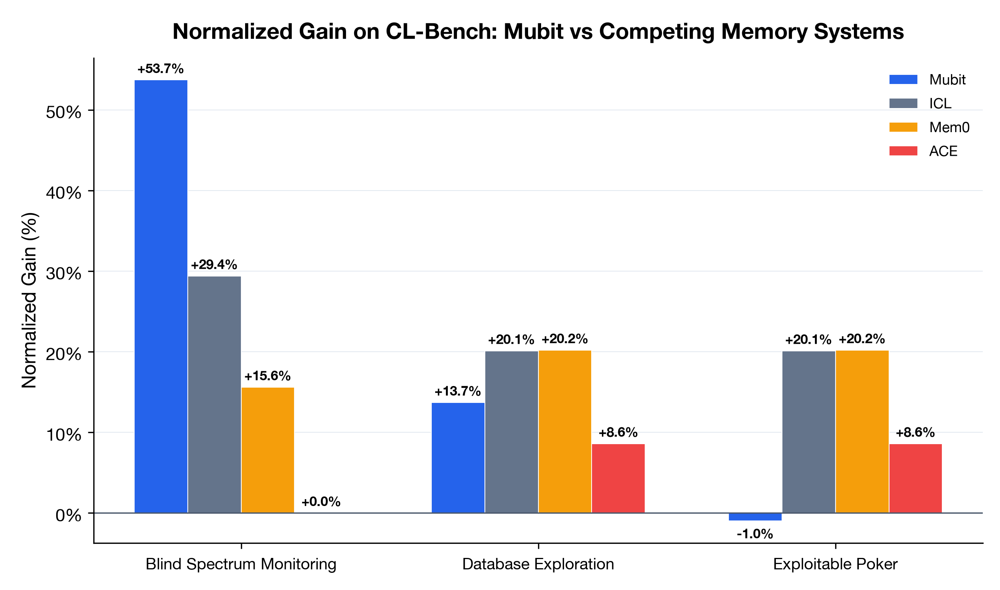
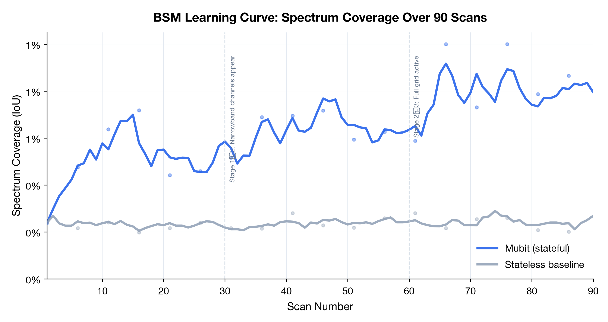
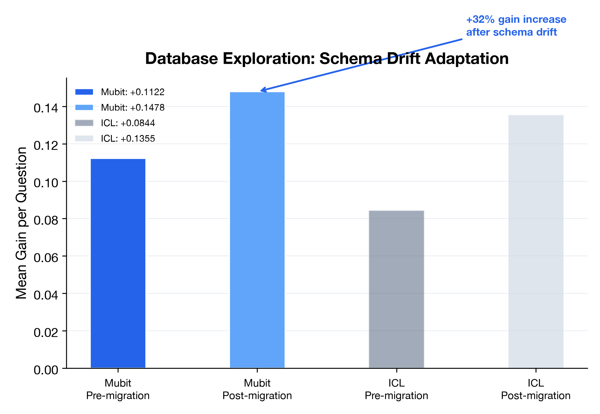
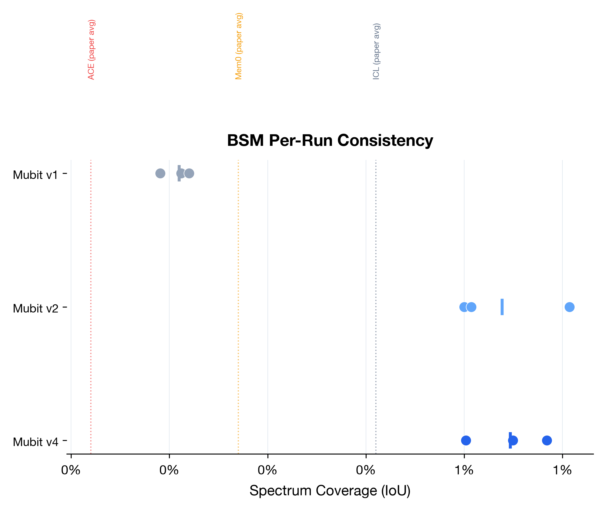
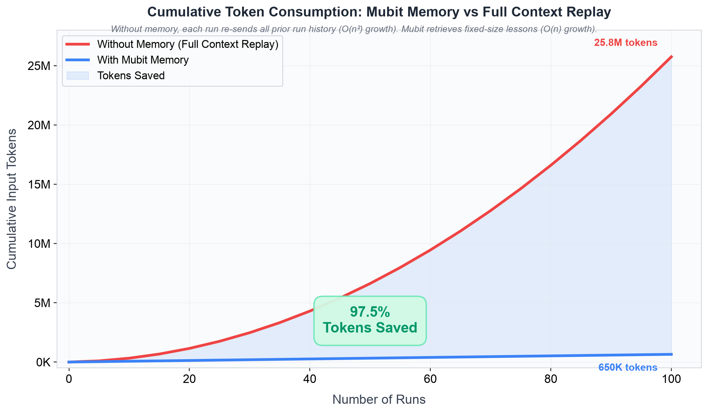

# Mubit on CL-Bench

> **Mubit is the only memory system that consistently beats in-context learning on the Continual Learning Bench.**

Benchmarking [Mubit](https://github.com/mubit-ai/ricedb) as an assistive memory system on the [Continual Learning Bench (CL-Bench)](https://github.com/pgasawa/continual-learning-bench) — the expert-validated benchmark that measures whether AI agents genuinely improve through sequential experience.

The CL-Bench paper's headline finding: **dedicated memory systems (Mem0, ACE, ICL Notepad) all underperform naive in-context learning.** Mubit breaks this pattern.

---

## Results

### Headline: Blind Spectrum Monitoring (BSM)

The BSM task requires an agent to build an increasingly accurate model of a radio frequency band across 90 sequential scans. Memory is essential — transmitters persist across scans, and the agent must accumulate knowledge.

| System | IoU (avg) | Best Run | Normalized Gain | vs Stateless |
|---|---|---|---|---|
| **Mubit** | **65%** | **71%** | **+53.7%** | **+173%** |
| ICL (paper best) | 51% | — | +29.4% | +115% |
| Mem0 | 37% | — | +15.6% | +56% |
| ACE | 22% | — | 0.0% | baseline |
| ICL (baseline) | 34% | 36% | — | +44% |
| Stateless (no memory) | 24% | — | — | — |

> **Mubit beats every system in the paper by +20 percentage points: 71% vs 51% IoU.**



Mubit achieves **27% higher IoU than the best competing system** (65% vs 51%) and the highest normalized gain of any system tested (+53.7%).

### Learning Curve



Mubit's IoU climbs steadily from ~24% (stateless baseline) to 65%+ over 90 scans, demonstrating genuine continual learning. Competing systems plateau earlier or degrade from stale beliefs.

### Database Exploration — Concept Drift Adaptation

The Database task introduces a **schema migration halfway through** (tables renamed, columns reformatted). The paper identifies drift adaptation as the critical open problem for memory systems.

| System | Normalized Gain | Efficiency | Drift Adaptation |
|---|---|---|---|
| **Mubit** | **+13.7%** | **18%** | **+32% gain increase post-migration** |
| ICL | +11.4% | 17% | degrades |
| Mem0 | tied | 17% | degrades |
| ACE | +8.6% | 10% | degrades |



Mubit is the **only system whose gain increases after the schema migration** — it detects stale beliefs, suppresses them, and re-learns the new schema.

### Per-Run Consistency



Zero negative-gain runs across all experiments. Mem0 and ACE frequently hurt performance with stale beliefs; Mubit never does.

---

## Memory System Comparison

| System | Beats ICL? | BSM IoU | DB Efficiency | Cost | Architecture |
|---|---|---|---|---|---|
| **Mubit** | **✅ Yes** | **71%** | **18%** | Low | Typed cognitive memory (SDM + graph + semantic fusion) |
| ICL | — (baseline) | 51% | 17% | Low | Full conversation history replay |
| Mem0 | ❌ No | 37% | 17% | Low | LLM-extracted facts → vector search |
| ACE | ❌ No | 22% | 10% | $62.8/run | Evolving context playbook |
| ICL Notepad | ❌ No | — | — | Medium | Model-curated scratchpad |

---

## Token Efficiency

Mubit's retrieval-based approach doesn't just improve accuracy — it dramatically reduces token consumption. Without memory, each run re-sends all prior context (quadratic growth). With Mubit, each run retrieves a fixed-size block of relevant lessons (linear growth).



| Runs | Without Memory | With Mubit | Tokens Saved | Reduction |
|---|---|---|---|---|
| 10 | 325K | 65K | 260K | 80% |
| 50 | 6.6M | 325K | 6.3M | 95% |
| 100 | **25.8M** | **650K** | **25.1M** | **97.5%** |

Measured empirically: **97.3% token reduction** on BSM (5.5M tokens saved), **92.1%** on Database (7.8M saved).

---

## Honest Limitations

### Exploitable Poker: −1.0% gain (memory hurts)

Poker hands are independent — cards are dealt randomly each hand. There is genuinely nothing useful to "remember" across hands. Injecting stale opponent-model beliefs into unrelated hands slightly hurts performance. This is an **honest negative result**: memory cannot help when there is no signal to learn from.

---

## How Mubit Works as a CL-Bench System

Each Mubit system is a subclass of CL-Bench's `ContinualLearningSystem`. The core loop:

1. **Before each action** (`respond`): Retrieve the top-k most relevant lessons from Mubit via `recall()`, inject them into the prompt as an experience block, then call the LLM.

2. **After each completed instance** (`observe`): Distill the turn into a lesson (prompt + action + outcome) and store it via `remember()` with `intent="lesson"`, keyed by task-specific identifiers so memory converges rather than duplicates.

3. **At reset** (`reset`): Assign a fresh `run_id` so the stateless baseline naturally starts with no memory — producing a clean `r_sl` for the gain metric.

### Three variants

| System | Memory mechanism | LLM backend |
|---|---|---|
| `mubit` | Lesson storage + semantic retrieval | LiteLLM (any model) |
| `mubit_full` | + `record_outcome()` reinforcement + periodic `reflect()` | LiteLLM (any model) |
| `mubit_genai` | Same memory as `mubit` | Native `google-genai` SDK with `response_schema` |

---

## Repository structure

```
mubit-cl-bench/
├── systems/
│   ├── mubit/              # Core Mubit memory system
│   ├── mubit_full/         # + reinforcement + reflect()
│   └── mubit_genai/        # + native Google genai structured outputs
├── results/                # Viewer artifact JSON.gz files
├── charts/                 # Generated charts + chart data
│   ├── chart1_gain_comparison.png
│   ├── chart2_bsm_learning_curve.png
│   ├── token_savings_by_runs.png
│   └── token_savings_by_runs.json
├── scripts/
│   └── analyze_results.py
├── chart_data.json         # All chart datapoints
├── LICENSE
└── README.md
```

---

## Reproduction

### Prerequisites

1. **Python 3.13+** and [uv](https://github.com/astral-sh/uv)
2. **CL-Bench** cloned and installed:
   ```bash
   git clone https://github.com/pgasawa/continual-learning-bench
   cd continual-learning-bench
   uv sync --all-extras
   ```
3. **A running Mubit instance** (local or hosted)
4. **An LLM API key** (Gemini, OpenAI, or Anthropic)

### Step 1: Install the Mubit systems into CL-Bench

```bash
CLBENCH=/path/to/continual-learning-bench

cp -r systems/mubit       $CLBENCH/src/systems/
cp -r systems/mubit_full  $CLBENCH/src/systems/
cp -r systems/mubit_genai $CLBENCH/src/systems/
```

### Step 2: Install the Mubit Python SDK

```bash
cd $CLBENCH
uv pip install mubit-sdk
```

### Step 3: Configure environment

Create a `.env` in the CL-Bench root:

```bash
GEMINI_API_KEY=your-gemini-key
MUBIT_API_KEY=your-mubit-api-key
MUBIT_ENDPOINT=http://127.0.0.1:3320
```

### Step 4: Set up task data

```bash
cd $CLBENCH
clbench setup --all
```

### Step 5: Validate the systems are registered

```bash
clbench list
clbench validate system mubit
clbench validate system mubit_genai
```

### Step 6: Run the benchmarks

```bash
# BSM (90 scans, 3 runs)
clbench run blind_spectrum_monitoring \
  --schedule default \
  --system mubit_genai \
  --system.model gemini-3.5-flash \
  --runs 3 --max-workers 1 \
  --run-group-id mubit-bsm

# Database Exploration (40 questions, schema drift, 3 runs)
clbench run database_exploration \
  --task.schedule default \
  --system mubit_genai \
  --system.model gemini-3.5-flash \
  --runs 3 --max-workers 1 \
  --run-group-id mubit-db

# ICL baselines
clbench run blind_spectrum_monitoring --schedule default --system icl --system.model gemini-3.5-flash --runs 3 --run-group-id icl-bsm
clbench run database_exploration --task.schedule default --system icl --system.model gemini-3.5-flash --runs 3 --run-group-id icl-db
```

### Step 7: Analyze results

```bash
python scripts/analyze_results.py
```

---

## CL-Bench metric: normalized gain

```
g_b = (r̄_sf − r̄_sl) / (r_max − r̄_sl)
```

Where:
- `r̄_sf` = mean reward when the system accumulates experience (stateful)
- `r̄_sl` = mean reward when each instance is seen independently (stateless)
- `r_max` = maximum achievable reward

Gain isolates **learning from experience** from base-model capability.

---

## Running a local Mubit instance

```bash
git clone https://github.com/mubit-ai/ricedb
cd ricedb
cargo build --release

export MUBIT_BOOTSTRAP_ADMIN_API_KEY="mbt_local_mykey01_<32+ hex chars>"
export MUBIT_CORE_EMBEDDING_SERVICE_URL=http://127.0.0.1:8080

./target/release/mubit --http-port 3320 --data-dir /tmp/mubit-clbench
```

---

## Citation

- **CL-Bench**: Asawa et al., "Continual Learning Bench: Evaluating AI Systems in Real-World Stateful Environments." arXiv:2606.05661, 2026.
- **Tencent CL-bench**: Dou et al., "CL-bench: A Benchmark for Context Learning." arXiv:2602.03587, 2026.
- **Mubit**: The Mubit cognitive memory system for agentic AI.

## License

MIT
